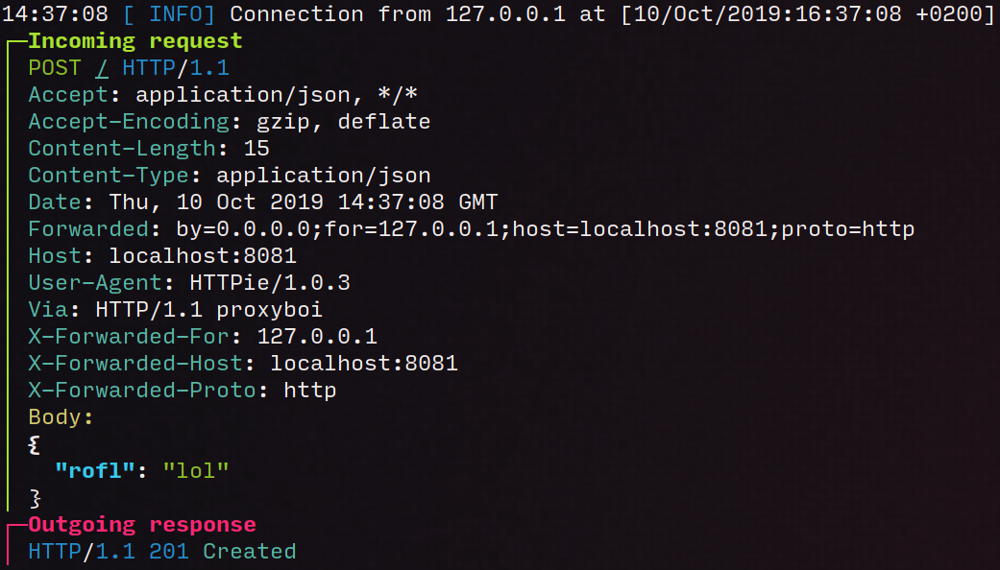

# dummyhttp

**A super simple HTTP server that replies with a fixed body and a fixed response code**

This is a simple, small, self-contained, cross-platform CLI tool for debugging
and testing.
It allows you to return arbitrary HTTP responses and log incoming request data.
HTTP/2 support included.

## How to use

### Log all incoming request data

    dummyhttp --verbose
    curl -X POST localhost:8080 -d hi
    # ┌─Incoming request
    # │ POST / HTTP/1.1
    # │ Accept: */*
    # │ Content-Length: 2
    # │ Host: localhost:8080
    # │ User-Agent: curl/7.66.0
    # │ Content-Type: application/x-www-form-urlencoded
    # │ Body:
    # hi

Example with color:

### Running with no arguments always returns 200 on all interfaces at port 8080

    dummyhttp
    curl -v localhost:8080
    # < HTTP/1.1 200 OK
    # < content-length: 10
    # < date: Sat, 09 Jun 2018 13:56:14 GMT
    # <
    # dummyhttp

### Always emit 400 Bad Request

    dummyhttp -c 400
    curl -v localhost:8080
    # < HTTP/1.1 400 Bad Request
    # < content-length: 10
    # < date: Sat, 09 Jun 2018 13:57:53 GMT
    # <
    # dummyhttp

### Always return a certain string

    dummyhttp -b "Hello World"
    curl -v localhost:8080
    # < HTTP/1.1 200 OK
    # < content-length: 12
    # < date: Sat, 09 Jun 2018 13:58:57 GMT
    # <
    # Hello World

### Return a specific header

    dummyhttp -b '{"Hello": "World"}' -H "content-type:application/json"
    curl -v localhost:8080
    # < HTTP/1.1 200 OK
    # < content-type: application/json
    # < date: Wed, 24 Aug 2022 00:55:35 +0200
    # < content-length: 18
    # <
    # {"Hello": "World"}

## How to install

**On Linux**: Download `dummyhttp-linux-amd64` from [the releases page](https://github.com/svenstaro/dummyhttp/releases) and run

    chmod +x dummyhttp-linux-amd64
    ./dummyhttp-linux-amd64

**On macOS**: Download `dummyhttp-macos-amd64` from [the releases page](https://github.com/svenstaro/dummyhttp/releases) and run

    chmod +x dummyhttp-macos-amd64
    ./dummyhttp-macos-amd64

**On Windows**: Download `dummyhttp-windows-amd64.exe` from [the releases page](https://github.com/svenstaro/dummyhttp/releases) and run

    dummyhttp-windows-amd64.exe

**With Cargo**: If you have a somewhat recent version of Rust and Cargo installed, you can run

    cargo install dummyhttp
    dummyhttp

## Full options

    dummyhttp 1.0.2
    Sven-Hendrik Haase <svenstaro@gmail.com>
    Super simple HTTP server that replies with a fixed body and a fixed response code

    USAGE:
        dummyhttp [OPTIONS]

    OPTIONS:
        -b, --body <BODY>
                HTTP body to send

                Supports Tera-based templating (https://tera.netlify.app/docs/) with a few additional
                functions over the default built-ins:

                uuid() - generate a random UUID
                lorem(words) - generate `words` lorem ipsum words

                Example: dummyhttp -b "Hello {{ uuid() }}, it's {{ now() | date(format="%Y") }} {{ lorem(words=5)}}"

                [default: dummyhttp]

        -c, --code <CODE>
                HTTP status code to send

                [default: 200]

        -h, --help
                Print help information

        -H, --headers <HEADERS>
                Headers to send (format: key:value)

        -i, --interface <INTERFACE>
                Interface to bind to

                [default: 0.0.0.0]

        -p, --port <PORT>
                Port on which to listen

                [default: 8080]

            --print-completions <shell>
                Generate completion file for a shell

                [possible values: bash, elvish, fish, powershell, zsh]

            --print-manpage
                Generate man page

        -q, --quiet
                Be quiet (log nothing)

            --tls-cert <TLS_CERT>
                TLS certificate to use

            --tls-key <TLS_KEY>
                TLS private key to use

        -v, --verbose
                Be verbose (log data of incoming and outgoing requests). If given twice it will also log the body data

        -V, --version
                Print version information

## Releasing

This is mostly a note for me on how to release this thing:

- Make sure `CHANGELOG.md` is up to date.
- `cargo release <version>`
- `cargo release --execute <version>`
- Releases will automatically be deployed by GitHub Actions.
- Update Arch package.
